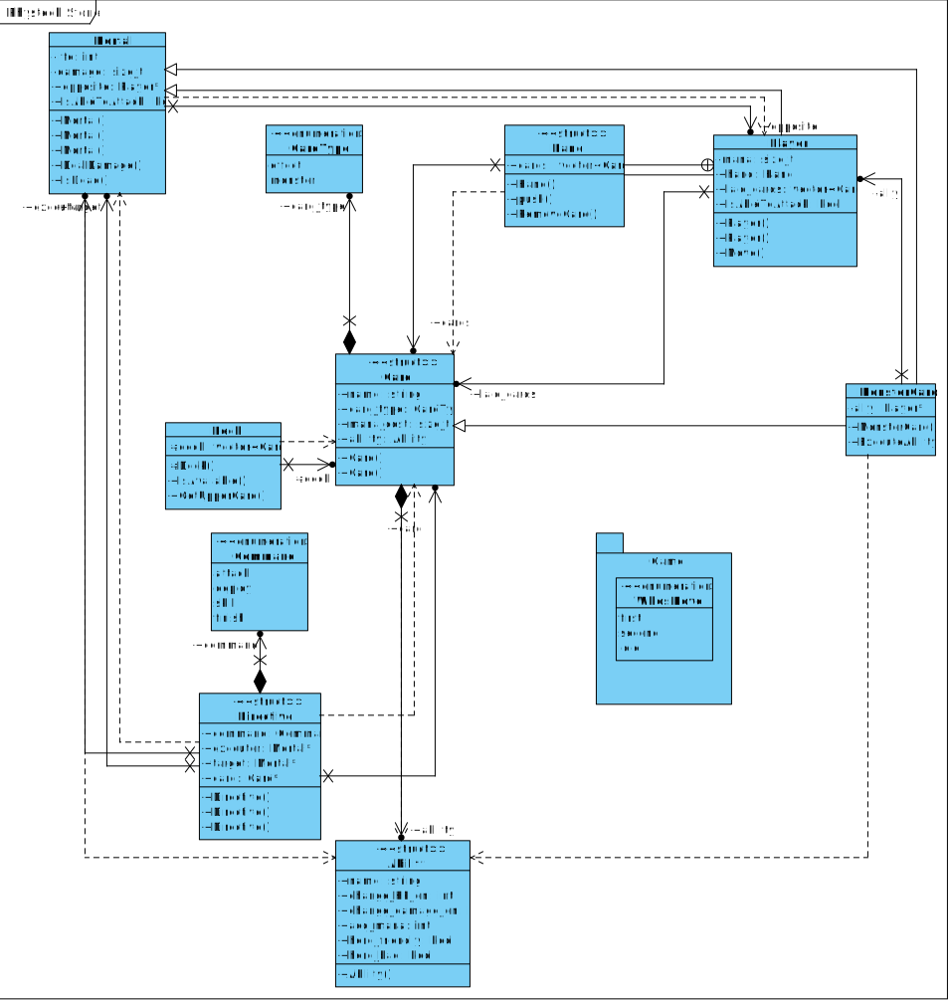

# Физтех.stone
## Обзор
Это карточная игра с двумя игроками, где можно как угодно кастомизировать карты. Игроки ходят по очереди, проигрывает тот у кого будет
неположительное количество здоровья после какого-то хода. Колода генерируется из файла и перемешивается случайным образом.

## Запуск
```sh
mkdir build/ && cd build/
cmake ..
make
./project
```

## UML диаграмма классов


## TODO:

https://docs.google.com/document/d/1OFr1lBNB8nX5dye98dLrJ3lrF7pRCa6lxNqJlx9oYio
 * ~~Осознать основные механики~~
 * ~~Объявить тела некоторых функции и пространств имен~~
 * ~~Реализовать builder(hard, required)~~
     * ~~Реализовать конструкторы (hard, required)~~
     * ~~Система генерации колоды и руки (easy, not required)~~
     * ~~Реализовать базу данных карт (medium, required)~~
 * ~~Улучшить систему передачи ходов (medium, not required)~~
 * ~~Реализовать систему передачи команд (hard, required)~~
     * Exception safety (easy)
     * ~~Придумать язык (easy)~~
     * ~~Получить адрес карты/героя (easy)~~
 * ~~Реализовать автокаст абилок (easy, required) ~~
 * ~~Реализовать bot (very hard, not required)~~
 * ~~Нарисовать UML диаграмму классов (medium, required)~~
